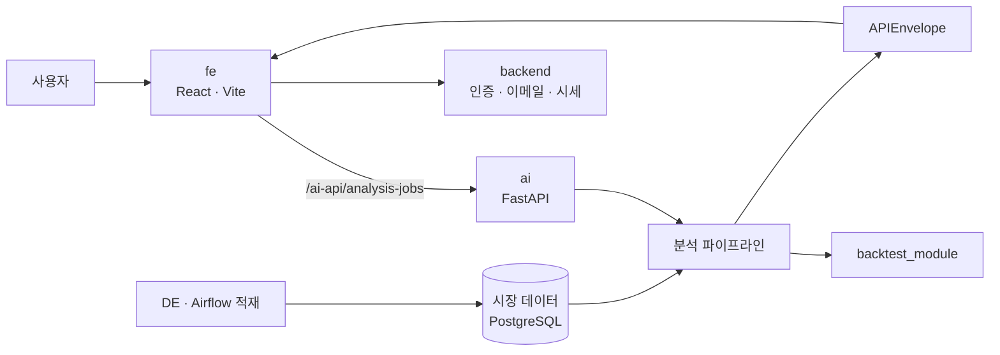

<div align="center">

# QuantAgent

**자연어 한 문장으로 한국 주식 전략을 만들고, 백테스트하고, 리포트까지 받는 AI 퀀트 에이전트**

[](https://github.com/yminh0/Quant_agent/actions/workflows/code-check.yml)
[](LICENSE)


[주요 기능](#주요-기능) · [동작 방식](#동작-방식) · [기술 스택](#기술-스택) · [빠른 시작](#빠른-시작) · [저장소 구성](#저장소-구성) · [문서](#문서)

</div>

---

"거래대금 상위 종목 중 추세가 살아 있는 종목을 골라줘" 같은 요청을 입력하면, QuantAgent가 요청을 정형화된 전략으로 바꾸고 KRX 시점 데이터(point-in-time)로 백테스트한 뒤 매매 신호와 리스크 판정이 담긴 리포트를 돌려줍니다.

## 주요 기능

- **자연어 → 전략** — 모호한 요청은 되묻고, 해석된 조건을 전략 코드로 만듭니다.
- **생존편향 없는 백테스트** — 상장폐지 종목까지 포함한 PIT 유니버스, walk-forward 검증, 조건 미달 시 자동 개선 라운드.
- **수용 기준 게이트** — 미사용 구간 Sharpe·최대 낙폭·거래 수·벤치마크 비교로 전략을 판정합니다.
- **신호·리스크·리포트** — 매매 신호, 리스크 매니저 판정, 근거가 붙은 리포트를 한 번에 생성합니다.
- **비동기 분석 job** — 분석은 큐에 들어가 백그라운드로 실행되고, 진행 상황은 이벤트 스트림으로 받습니다.
- **리포트 이메일 · Google 로그인** — 완료된 리포트를 메일로 받아볼 수 있습니다.

## 동작 방식



분석 파이프라인은 다음 순서로 실행됩니다.

`Supervisor → Ambiguity → Data → Research → BacktestCode → Backtest → Signal → Risk Manager → Report`

## 기술 스택

| 영역 | 기술 |
| --- | --- |
| **Frontend** | React 19, TypeScript, Vite, Tailwind CSS 4 |
| **AI 파이프라인** | Python 3.11, FastAPI, Pydantic v2, LangChain · LangGraph(초기 에이전트 그래프) → 자체 순차 파이프라인(`ExplicitAnalysisPipeline`) |
| **LLM** | Azure OpenAI Responses API(web search tool 포함), 역할별 모델 분리(Research · Signal · Report의 Bull/Bear/Judge, 코드 생성) |
| **백테스트** | NumPy, TA-Lib, QuantStats, walk-forward 검증 · 프로세스 풀 병렬 평가 |
| **Backend** | FastAPI, SQLAlchemy(asyncio) · asyncpg, Redis 세션, Google OAuth, Brevo 이메일, PyMuPDF |
| **데이터** | PostgreSQL · TimescaleDB(`meta/raw/core/feature/mart` + 서비스 `app` 스키마), Apache Airflow 2.9 |
| **데이터 소스** | KRX, 한국투자증권(KIS) Open API, OpenDART, 한국은행 ECOS, FnGuide WICS |
| **운영** | GitHub Actions(CI · 배포 · 릴리스 게이트 · 헬스체크), Rocky Linux 8.10, pytest · ruff · node test |

에이전트 그래프는 처음에 LangChain과 LangGraph(`StateGraph`)로 구성했습니다. 이후 LangGraph 설치 여부에 따라 실행 경로가 갈리는 문제를 없애기 위해, 같은 노드 순서를 직접 실행하는 `ExplicitAnalysisPipeline`으로 정리했습니다. LLM 호출은 `httpx` 기반 Azure OpenAI 클라이언트가 담당하고, 로컬과 CI에서는 mock 클라이언트로 결정론적으로 실행합니다.

## 빠른 시작

**요구사항**: Python 3.11, Node 24 (운영 기준 OS는 Rocky Linux 8.10)

```bash
git clone https://github.com/yminh0/Quant_agent.git && cd Quant_agent

# venv는 반드시 저장소 밖에 만듭니다
python3 -m venv ~/.venvs/quantagent
~/.venvs/quantagent/bin/python -m pip install -e ./backtest_module -e ./ai -e "./backend[test]" pytest ruff

# 외부 DB·LLM 없이 도는 결정론 테스트
AUTH_ENABLED=0 AI_LLM_PROVIDER=mock AI_JOB_STORE=memory AI_AUDIT_SINK=noop \
  ~/.venvs/quantagent/bin/python -m pytest -q ai/tests

# 프론트엔드
cd fe && npm install && npm run dev
```

> [!NOTE]
> 로컬 실행은 fixture/mock 데이터로 동작하며 단위·계약 검증용입니다. 실제 스크리닝·백테스트 결과는 PostgreSQL과 LLM이 연결된 서버에서만 나옵니다.

<details>
<summary><b>모듈별 테스트 명령</b></summary>

| 대상 | 명령 |
| --- | --- |
| ai | `AUTH_ENABLED=0 AI_LLM_PROVIDER=mock AI_JOB_STORE=memory AI_AUDIT_SINK=noop py -m pytest -q ai/tests` |
| backend | `py -m pytest -q backend/tests` (위 env 없이 실행) |
| backtest | `py -m pytest -q backtest_module/tests` |
| DB 계약 | `py -m pytest -q service_db/tests` |
| lint | `py -m ruff check --select E9,F63,F7 ai/ai_graph ai/tests backtest_module backend/app backend/tests` |
| fe | `cd fe && npm run test` |

`py`는 `~/.venvs/quantagent/bin/python`입니다.

</details>

## 저장소 구성

| 디렉터리 | 역할 |
| --- | --- |
| [`fe/`](fe) | React + TypeScript + Vite 웹 클라이언트 |
| [`ai/`](ai) | 분석 API와 파이프라인 (`ai_graph`) |
| [`backtest_module/`](backtest_module) | 백테스트 엔진 |
| [`backend/`](backend) | Google OAuth·세션, 리포트 이메일, 시세 티커 |
| [`DE/`](DE) · [`DE/airflow/`](DE/airflow) | OHLCV·지표·유니버스 적재와 데이터 마이그레이션 |
| [`service_db/`](service_db) | 서비스 DB 마이그레이션 (job·정책·감사) |
| [`scripts/`](scripts) · [`.github/workflows/`](.github/workflows) | 배포 게이트, CI, 서버 헬스체크 |

## 문서

- [운영·검증 가이드](docs/OPERATIONS.md) — 실행 프로필, 동시성 상한, 수용 기준 게이트, 단일 프로세스 계약, 이메일 운영
- [프로젝트 흐름 가이드](docs/PROJECT_FLOW_AND_DEBT_GUIDE.md) — 실제 실행 경로와 데이터 흐름
- [AI 실행 가이드](ai/README_AI.md) · [FE 실행 가이드](fe/README.md)

## 기여

커밋 메시지는 `[TYPE] 간결한 제목` 형식을 따릅니다. (예: `[DOCS] README 커밋 컨벤션 추가`)

| TYPE | 용도 |
| --- | --- |
| **FEAT** | 새로운 기능 추가 |
| **FIX** | 버그 수정 |
| **DOCS** | 문서 수정(README, 가이드, 주석 등) |
| **STYLE** | 코드 포맷/세미콜론/공백 등, 로직 변경 없음 |
| **REFACTOR** | 리팩터링(동작 동일, 구조 개선/성능 향상) |
| **TEST** | 테스트 코드 추가/수정 |
| **CHORE** | 빌드/배포/의존성/스크립트 등 개발환경 변경 |

GitHub Issues는 CI 실패 자동화에 쓰이므로 커밋 메시지에 이슈 번호를 강제하지 않습니다.

## 면책

QuantAgent의 백테스트와 신호는 과거 데이터에 기반한 참고 정보이며 투자 권유가 아닙니다. 투자 판단과 그 결과의 책임은 이용자에게 있습니다.

## 라이선스

[MIT](LICENSE) © 2026 YOON MINHO
